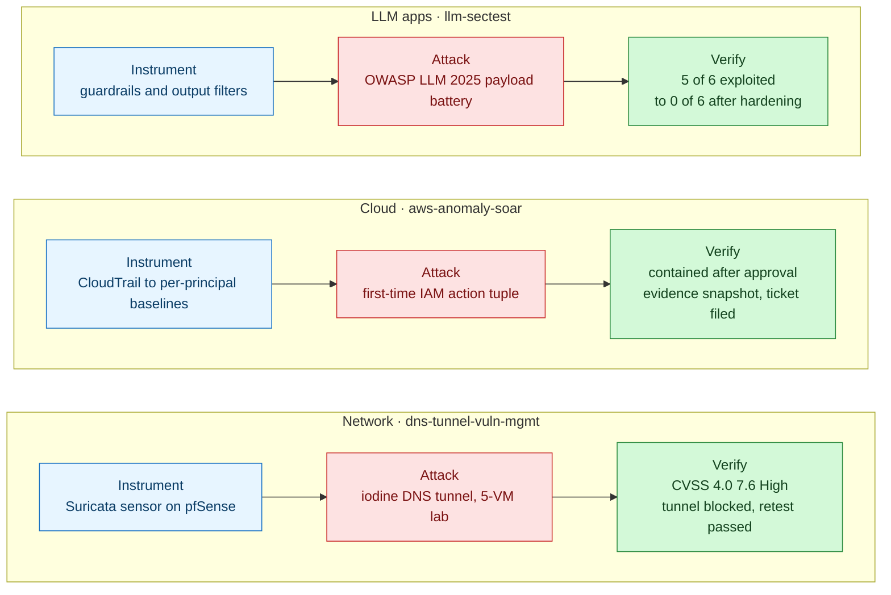
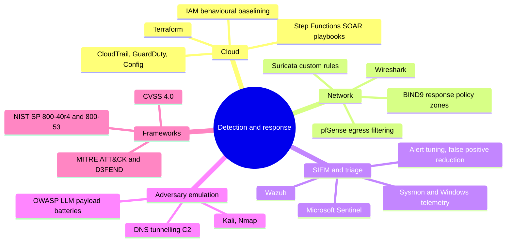
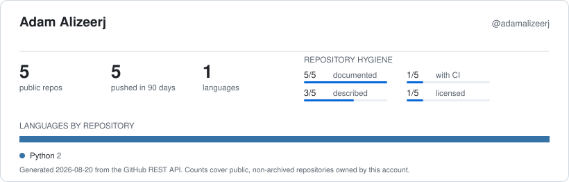

<!-- Profile README for github.com/adamalizeerj -->
<!-- This file only renders on the profile if the repo is PUBLIC and named exactly "adamalizeerj" -->
<!-- last reviewed: 2026-08 -->

# Adam Alizeerj

**Security engineer building detection and automated response for cloud, network, and LLM systems.**

I instrument a system, run a real attack against it, then measure whether the control held. Three projects, three layers of the stack, verification evidence checked into every repo.

Cybersecurity undergraduate, B.S. expected 2028. CompTIA Security+ certified, CySA+ in progress.

<!-- Resume button is generated and ready at assets/btn-resume.svg. Uncomment once the PDF has a URL:

-->
<!-- TODO: host the resume PDF (GitHub Pages, or a file in this repo) and fill in the href above -->

---

## How the work fits together

The same loop applied at three layers. Build the control, attack it, prove what held.

---

## Selected work

| Project | Layer | Headline result | Stack |
|---|---|---|---|
| **[aws-anomaly-soar](https://github.com/adamalizeerj/aws-anomaly-soar)** | Cloud | Six-step containment playbook gated on human approval. A break-glass list keeps root and admin principals out of auto-containment, added after containment locked out the admin user on a live run. Steady state about $5 to $7 a month | Terraform · Lambda · DynamoDB · Step Functions · EventBridge |
| **[llm-sectest](https://github.com/adamalizeerj/llm-sectest)** | LLM apps | 5 of 6 OWASP LLM 2025 categories exploitable on the vulnerable target, 0 of 6 after hardening, with a deterministic suite proving the controls hold. All inference runs locally | Python 3.12 · pytest · FastAPI · Ollama · YAML payload catalogue |
| **[dns-tunnel-vuln-mgmt](https://github.com/adamalizeerj/dns-tunnel-vuln-mgmt)** | Network | Covert DNS C2 scored CVSS 4.0 7.6 High and mapped to T1071.004 and T1572. Four-control remediation blocked the tunnel at the firewall and sinkholed the domains, verified end to end | pfSense · Suricata · BIND9 RPZ · Wazuh on ARM64 · 5-VM UTM lab |

**Open these first**, in about two minutes and without cloning anything:

- [ATT&CK coverage with the gaps left in](https://github.com/adamalizeerj/aws-anomaly-soar/blob/main/docs/mitre-attack-coverage.md). What the detections catch, and what they miss.
- [Before and after scan reports](https://github.com/adamalizeerj/llm-sectest/tree/main/reports/before). The raw evidence behind 5 of 6 to 0 of 6.
- [Retest results](https://github.com/adamalizeerj/dns-tunnel-vuln-mgmt/blob/main/04-verification/retest-results.md). Proof the remediation actually took.
- [SOC runbooks](https://github.com/adamalizeerj/aws-anomaly-soar/tree/main/runbooks). One per detection class, written to be handed to someone on shift.

---

## Where the depth is

---

## How I work

- **Every finding ships with an oracle.** In `llm-sectest` each attack carries a programmatic success check that asserts the exploit actually landed, so a result is reproducible instead of eyeballed from model output.
- **I write down what broke.** Containment locked out the admin user. A Lambda C extension built for arm64 macOS would not load on the Linux runtime. Slack silently dropped a malformed approval button while returning HTTP 200. All three are in the READMEs with the root cause and the fix.
- **Infrastructure is code, including the teardown.** Terraform in ordered phases, a documented destroy path, and a cost table so the lab returns to zero.
- **Coverage claims come with the gaps attached.** Detections map to ATT&CK and D3FEND, and the mapping table says plainly which techniques are not covered yet.

---

## Snapshot

<picture>
  <source media="(prefers-color-scheme: dark)" srcset="assets/profile-card-dark.svg">
  
</picture>

Generated from the public API and [refreshed weekly by an Action](.github/workflows/profile-card.yml), so it never drifts out of date. It reports documentation and licensing coverage rather than star counts, because those are the numbers that say something about the repositories.

---

## Currently

Working toward CySA+, and extending the SOAR pipeline with a dedicated rule for CloudTrail and GuardDuty tampering that bypasses the baseline warm-up. That gap is the highest-value one left open, and it is written up in the [tampering runbook](https://github.com/adamalizeerj/aws-anomaly-soar/blob/main/runbooks/cloudtrail-tampering.md) rather than quietly left out.

All three projects are lab builds on hardware I own, not production deployments. Each README says which parts were measured and which are still assumptions.

## Reach me

[LinkedIn](https://linkedin.com/in/aalizeerj) · [adamalizeerj@gmail.com](mailto:adamalizeerj@gmail.com)
